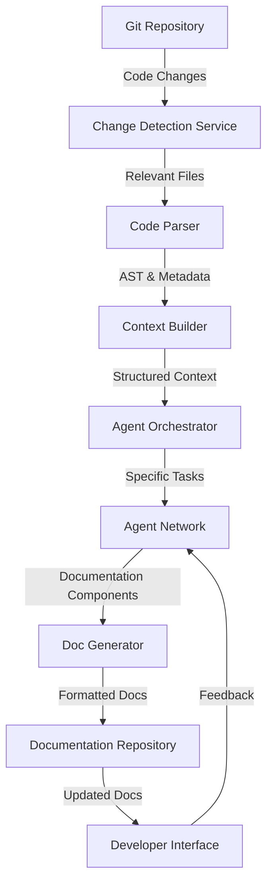

Tôi đang muốn xây dựng 1 AI Agent chuyên về đọc hiểu source code của các dự án từ đó tạo ra nhiều documents về dự án đó. Mục đích để các developer mới có thể hiểu dự án nhanh, và tạo ra 1 bộ tài liệu được update theo thời gian thực theo mỗi commit changes.

Hãy giúp tôi lên ý tưởng, kiến trúc để thực hiện. Đặc biệt với sự phát triển mạnh mẽ của các LLM và AI Agent Framework như Langchain, CrewAI như hiện nay.
Tôi cần overview, high level design, data flow và functional flows

GitHub Copilot: # CodeDoc AI Agent: Architecture & Design

## 1. Overview

**CodeDoc AI Agent** sẽ là một hệ thống AI đa tác nhân chuyên phân tích mã nguồn và tạo tài liệu theo thời gian thực. Hệ thống sẽ:

- **Phân tích codebase** từ các góc độ khác nhau (architecture, data flow, components)
- **Tạo và cập nhật documentation** theo mỗi commit change
- **Hỗ trợ onboarding** cho developers mới
- **Cung cấp insights** về code quality, patterns, và architectural decisions


## 2. High-Level Design

### 2.1 Kiến trúc tổng quan

```
┌────────────────────┐     ┌─────────────────────┐     ┌─────────────────┐
│                    │     │                     │     │                 │
│  Code Repository   │────►│  CodeDoc AI System  │────►│  Documentation  │
│  (Git/GitHub)      │     │  (Agent Network)    │     │  Repository     │
│                    │     │                     │     │                 │
└────────────────────┘     └─────────────────────┘     └─────────────────┘
          ▲                         │                          │
          │                         │                          │
          └─────────────────────────┼──────────────────────────┘
                                    │
                             ┌──────▼───────┐
                             │              │
                             │  Developer   │
                             │  Interface   │
                             │              │
                             └──────────────┘
```

### 2.2 AI Agent Network (CrewAI Architecture)

```
┌────────────────────────────────────────────────────────────┐
│                    CodeDoc Agent Network                   │
│                                                            │
│  ┌──────────────┐  ┌──────────────┐  ┌──────────────────┐  │
│  │              │  │              │  │                  │  │
│  │  CodeReader  │  │  Architect   │  │  DocumentWriter  │  │
│  │  Agent       │◄─►│  Agent      │◄─►│  Agent          │  │
│  │              │  │              │  │                  │  │
│  └──────────────┘  └──────────────┘  └──────────────────┘  │
│         ▲                 ▲                  ▲             │
│         │                 │                  │             │
│         ▼                 ▼                  ▼             │
│  ┌──────────────┐  ┌──────────────┐  ┌──────────────────┐  │
│  │              │  │              │  │                  │  │
│  │  PatternID   │  │  TestAnalyst │  │  Visualizer      │  │
│  │  Agent       │  │  Agent       │  │  Agent           │  │
│  │              │  │              │  │                  │  │
│  └──────────────┘  └──────────────┘  └──────────────────┘  │
│                                                            │
└────────────────────────────────────────────────────────────┘
```

## 3. Data Flow Architecture

### 3.1 Core Data Flow



### 3.2 Data Processing Pipeline

1. **Code Ingestion**
   - Repository cloning/fetching
   - Change detection (git diff)
   - File classification & prioritization

2. **Code Analysis**
   - AST (Abstract Syntax Tree) generation
   - Dependencies mapping
   - Type inference & validation
   - Pattern recognition

3. **Context Building**
   - Code context creation
   - Code block relationships
   - Technical debt identification
   - Architecture pattern detection

4. **Documentation Generation**
   - Markdown generation
   - Diagram creation (PlantUML, Mermaid)
   - API documentation
   - Onboarding guides

## 4. Functional Flows

### 4.1 Initial Repository Analysis

```
┌──────────────┐     ┌────────────────┐     ┌─────────────────┐     ┌──────────────────┐
│              │     │                │     │                 │     │                  │
│ Repository   │────►│ Code Structure │────►│ Deep Semantic   │────►│ Architecture     │
│ Ingestion    │     │ Analysis       │     │ Analysis        │     │ Identification   │
│              │     │                │     │                 │     │                  │
└──────────────┘     └────────────────┘     └─────────────────┘     └──────────────────┘
                                                                             │
┌──────────────────┐     ┌────────────────┐     ┌─────────────────┐          │
│                  │     │                │     │                 │          │
│ Document         │◄────┤ Documentation  │◄────┤ Knowledge Base  │◄─────────┘
│ Publication      │     │ Generation     │     │ Creation        │
│                  │     │                │     │                 │
└──────────────────┘     └────────────────┘     └─────────────────┘
```

### 4.2 Continuous Documentation Update Flow

```
┌──────────────┐     ┌────────────────┐     ┌─────────────────┐     ┌──────────────────┐
│              │     │                │     │                 │     │                  │
│ Git Hook/    │────►│ Change         │────►│ Impacted Areas  │────►│ Selective Agent  │
│ Webhook      │     │ Detection      │     │ Identification  │     │ Dispatch         │
│              │     │                │     │                 │     │                  │
└──────────────┘     └────────────────┘     └─────────────────┘     └──────────────────┘
                                                                             │
┌──────────────────┐     ┌────────────────┐     ┌─────────────────┐          │
│                  │     │                │     │                 │          │
│ Documentation    │◄────┤ Version        │◄────┤ Documentation   │◄─────────┘
│ Update           │     │ Control        │     │ Update          │
│                  │     │                │     │                 │
└──────────────────┘     └────────────────┘     └─────────────────┘
```

## 5. Thiết kế AI Agent với LangChain & CrewAI

### 5.1 Agent Roles & Specializations

#### CodeReader Agent
- **LLM**: GPT-4 hoặc Claude 3 Opus (tối ưu hóa cho đọc code)
- **Tools**: AST parsers, dependency analyzers
- **Memory**: Codebase vectorstore + retrieval system
- **Nhiệm vụ**: Đọc và hiểu cấu trúc code, detect patterns, phân tích dependencies

#### Architect Agent
- **LLM**: Claude 3 Opus (tối ưu hóa cho suy luận phức tạp)
- **Tools**: Architecture pattern recognition, UML generators
- **Memory**: System design patterns vectorstore
- **Nhiệm vụ**: Suy luận high-level architecture, design patterns, data flow

#### DocumentWriter Agent
- **LLM**: GPT-4 hoặc Claude 3 Sonnet (tối ưu hóa cho tạo nội dung)
- **Tools**: Markdown generators, documentation templates
- **Memory**: Documentation best practices, project history
- **Nhiệm vụ**: Tạo và cập nhật tài liệu rõ ràng, chính xác

#### PatternID Agent
- **LLM**: GPT-4 
- **Tools**: Pattern recognition algorithms
- **Memory**: Coding pattern database
- **Nhiệm vụ**: Xác định design patterns, anti-patterns, code smells

#### TestAnalyst Agent
- **LLM**: Claude 3 Haiku (tối ưu cho tác vụ đơn giản)
- **Tools**: Test coverage analyzers
- **Memory**: Testing best practices
- **Nhiệm vụ**: Phân tích test coverage, test quality

#### Visualizer Agent
- **LLM**: GPT-4 hoặc Claude 3 Opus
- **Tools**: Mermaid, PlantUML, D3.js
- **Memory**: Visualization best practices
- **Nhiệm vụ**: Tạo diagrams, visualizations từ codebase

### 5.2 CrewAI Implementation

```python
from crewai import Agent, Task, Crew, Process

# Define Agents
code_reader = Agent(
    role="CodeReader",
    goal="Understand code structure and patterns",
    backstory="Expert in reading and interpreting source code",
    verbose=True,
    tools=[code_parser, dependency_analyzer],
    llm=code_reader_llm
)

architect = Agent(
    role="Architect",
    goal="Identify system architecture and design patterns",
    backstory="Expert software architect with decades of experience",
    verbose=True,
    tools=[pattern_recognition, uml_generator],
    llm=architect_llm
)

document_writer = Agent(
    role="DocumentWriter", 
    goal="Create clear, accurate documentation",
    backstory="Expert technical writer specializing in developer documentation",
    verbose=True,
    tools=[markdown_generator],
    llm=writer_llm
)

# Define Tasks
code_analysis_task = Task(
    description="Analyze the codebase to understand structure and patterns",
    agent=code_reader,
    expected_output="A comprehensive analysis of code structure and patterns"
)

architecture_task = Task(
    description="Identify high-level architecture and design patterns",
    agent=architect,
    expected_output="System architecture document with identified patterns"
)

documentation_task = Task(
    description="Create comprehensive documentation based on analysis",
    agent=document_writer,
    expected_output="Complete project documentation in markdown format"
)

# Create and run the crew
documentation_crew = Crew(
    agents=[code_reader, architect, document_writer],
    tasks=[code_analysis_task, architecture_task, documentation_task],
    process=Process.sequential
)

result = documentation_crew.kickoff()
```

## 6. Core Components Implementation

### 6.1 Code Analysis Engine

```python
class CodeAnalysisEngine:
    def __init__(self, repo_path):
        self.repo_path = repo_path
        self.ast_parser = ASTParser()
        self.dependency_analyzer = DependencyAnalyzer()
        self.pattern_recognizer = PatternRecognizer()
        
    def analyze_repository(self):
        """Analyze entire repository and generate structured representation"""
        # Implementation logic
        
    def analyze_changes(self, commit_id):
        """Analyze changes in specific commit"""
        # Implementation logic
        
    def get_file_importance(self):
        """Identify important files based on dependencies and complexity"""
        # Implementation logic
```

### 6.2 Documentation Generator

```python
class DocumentationGenerator:
    def __init__(self, analysis_results, template_engine):
        self.analysis = analysis_results
        self.template = template_engine
        
    def generate_project_overview(self):
        """Generate high-level project overview"""
        # Implementation logic
        
    def generate_architecture_docs(self):
        """Generate architecture documentation with diagrams"""
        # Implementation logic
        
    def generate_component_docs(self):
        """Generate documentation for each component"""
        # Implementation logic
        
    def generate_onboarding_guide(self):
        """Generate developer onboarding guide"""
        # Implementation logic
```

### 6.3 Change Detector

```python
class ChangeDetector:
    def __init__(self, repo_path):
        self.repo_path = repo_path
        self.git_client = GitClient(repo_path)
        
    def detect_changes(self, from_commit, to_commit="HEAD"):
        """Detect changes between commits"""
        # Implementation logic
        
    def analyze_impact(self, changed_files):
        """Analyze impact of changes on system"""
        # Implementation logic
        
    def prioritize_documentation_updates(self, impact_analysis):
        """Prioritize documentation updates based on impact"""
        # Implementation logic
```

## 7. Triển khai thực tế

### 7.1 GitHub Integration

```python
from github import Github
from fastapi import FastAPI, Request

app = FastAPI()

@app.post("/webhook")
async def github_webhook(request: Request):
    payload = await request.json()
    
    # Process GitHub webhook
    if payload["action"] == "push":
        repo_name = payload["repository"]["full_name"]
        commit_id = payload["after"]
        
        # Trigger documentation update
        doc_updater = DocumentationUpdater(repo_name)
        doc_updater.update_for_commit(commit_id)
        
    return {"status": "processing"}
```

### 7.2 LangChain Tools Integration

```python
from langchain.tools import BaseTool
from langchain.agents import AgentType, initialize_agent
from langchain.llms import OpenAI

# Custom Code Analysis Tool
class CodeAnalysisTool(BaseTool):
    name = "code_analyzer"
    description = "Analyzes code structure and patterns"
    
    def _run(self, file_path):
        # Implementation logic
        return analysis_result
        
    def _arun(self, file_path):
        # Async implementation
        pass

# Initialize agent with tools
tools = [CodeAnalysisTool(), DependencyAnalyzerTool(), PatternRecognizerTool()]
llm = OpenAI(temperature=0)
agent = initialize_agent(tools, llm, agent=AgentType.ZERO_SHOT_REACT_DESCRIPTION)

# Use the agent
agent.run("Analyze the code structure in src/components/")
```

### 7.3 Vector Database cho Code Context

```python
from langchain.vectorstores import Chroma
from langchain.embeddings import OpenAIEmbeddings
from langchain.text_splitter import RecursiveCharacterTextSplitter

# Process code files
def build_code_vectorstore(repo_path):
    code_files = get_code_files(repo_path)
    combined_code = []
    
    for file in code_files:
        with open(file, 'r') as f:
            content = f.read()
            metadata = {"file": file, "language": detect_language(file)}
            combined_code.append({"content": content, "metadata": metadata})
    
    # Split code into chunks
    text_splitter = RecursiveCharacterTextSplitter(
        chunk_size=2000,
        chunk_overlap=200
    )
    texts = []
    metadatas = []
    
    for item in combined_code:
        chunks = text_splitter.split_text(item["content"])
        texts.extend(chunks)
        metadatas.extend([item["metadata"] for _ in chunks])
    
    # Create vector store
    embeddings = OpenAIEmbeddings()
    vectorstore = Chroma.from_texts(
        texts=texts,
        embedding=embeddings,
        metadatas=metadatas
    )
    
    return vectorstore
```

## 8. Output Documentation Format

CodeDoc AI Agent sẽ tạo tài liệu trong các định dạng sau:

### 8.1 Markdown Structure

```
/docs
├── project-overview.md
├── architecture/
│   ├── high-level-design.md
│   ├── data-flow.md
│   └── component-architecture.md
├── components/
│   ├── component1.md
│   ├── component2.md
│   └── ...
├── developer-guides/
│   ├── onboarding.md
│   ├── dev-workflow.md
│   └── best-practices.md
├── api-docs/
│   └── ...
└── insights/
    ├── code-quality.md
    ├── performance.md
    └── security.md
```

### 8.2 Interactive Documentation

- **Interactive diagrams** sử dụng Mermaid.js hoặc PlantUML
- **Code previews** với syntax highlighting
- **Searchable documentation** với full-text search

## 9. Challenges & Considerations

1. **Handling Large Codebases**
   - Sử dụng incremental analysis
   - Priority-based processing
   - Caching và lazy loading

2. **Accuracy & Quality**
   - Human feedback loop
   - Version control cho documentation
   - Multiple LLM validation

3. **Performance & Cost**
   - Batch processing
   - Selective document updating
   - Caching embeddings

4. **Security Concerns**
   - Code không được upload lên third-party
   - On-premise deployment options
   - Sensitive information filtering

5. **Integration Complexity**
   - Webhook reliability
   - CI/CD pipeline integration
   - Cross-platform support

## 10. Roadmap & Implementation Plan

1. **Phase 1: MVP**
   - Basic code analysis engine
   - Single agent architecture
   - GitHub integration
   - Markdown documentation generation

2. **Phase 2: Multi-Agent System**
   - CrewAI implementation
   - Specialized agent roles
   - Improved analysis quality
   - Interactive documentation

3. **Phase 3: Enterprise Features**
   - Team collaboration features
   - Custom documentation templates
   - Integration với Jira, Confluence
   - Advanced security features

4. **Phase 4: Autonomous Evolution**
   - Documentation prediction
   - Auto-refactoring suggestions
   - Code health monitoring
   - Knowledge graph construction

---

Với kiến trúc này, CodeDoc AI Agent sẽ giúp tự động hóa việc tạo và duy trì tài liệu dự án, giúp developer mới onboard nhanh hơn và đảm bảo tài liệu luôn được cập nhật với mỗi thay đổi code.

# Kế Hoạch Triển Khai CodeDoc AI Agent

## Phase 1: MVP (4-6 tuần)

### Bước 1: Thiết lập Project Infrastructure (1 tuần)
- [ ] Tạo repository cho project
- [ ] Cài đặt Python environment với các dependency cơ bản
- [ ] Thiết lập CI/CD pipeline đơn giản
- [ ] Cấu hình môi trường dev/staging/prod
- [ ] Tạo documentation skeleton

### Bước 2: Code Analysis Engine Core (2 tuần)
- [ ] Implement Git integration để clone và fetch repositories
- [ ] Xây dựng module phân tích cấu trúc file và directories
- [ ] Implement AST parser cho các ngôn ngữ phổ biến (JavaScript/TypeScript)
- [ ] Tạo priority algorithm để xác định file importance
- [ ] Viết unit tests cho các core functions

### Bước 3: LLM Integration & Single Agent (1-2 tuần)
- [ ] Cài đặt LangChain framework
- [ ] Tích hợp LLM model (GPT-4/Claude) 
- [ ] Xây dựng prompt templates cho code analysis
- [ ] Implement context window optimization
- [ ] Tạo agent đơn giản với capability đọc và phân tích code

### Bước 4: Documentation Generator (1 tuần)
- [ ] Tạo Markdown generator từ phân tích code
- [ ] Implement template system cho các loại documents
- [ ] Xây dựng module để organize content theo cấu trúc logic
- [ ] Hỗ trợ syntax highlighting cho code blocks

### Bước 5: GitHub Integration & Testing (1 tuần)
- [ ] Implement webhook receiver cho GitHub events
- [ ] Xây dựng change detection service
- [ ] Tạo web interface đơn giản để view documentation
- [ ] Thực hiện end-to-end testing với repositories thật

## Phase 2: Multi-Agent System (6-8 tuần)

### Bước 1: CrewAI Framework Setup (1 tuần)
- [ ] Tích hợp CrewAI framework
- [ ] Thiết kế agent communication protocol
- [ ] Xác định agent roles và responsibilities
- [ ] Implement agent orchestration system

### Bước 2: Specialized Agents (3 tuần)
- [ ] Implement CodeReader Agent với AST parsing tools
- [ ] Xây dựng Architect Agent với pattern recognition
- [ ] Tạo DocumentWriter Agent với templating và NLG
- [ ] Develop PatternID Agent với design pattern database
- [ ] Build TestAnalyst Agent với testing metrics analysis
- [ ] Implement Visualizer Agent với diagram generation

### Bước 3: Vector Database Integration (1 tuần)
- [ ] Setup Chroma/Pinecone vector database
- [ ] Implement code chunking và embedding
- [ ] Tạo retrieval system cho context-aware analysis
- [ ] Optimize embeddings cho code representation

### Bước 4: Advanced Documentation Features (2 tuần)
- [ ] Implement diagram generation (Mermaid, PlantUML)
- [ ] Add interactive elements to documentation
- [ ] Support cho multiple documentation formats
- [ ] Tạo searchable documentation interface

### Bước 5: Testing & Optimization (1 tuần)
- [ ] Comprehensive testing với diverse repositories
- [ ] Performance optimization cho large codebases
- [ ] Memory usage optimization
- [ ] Response time improvements

## Phase 3: Enterprise Features (8-10 tuần)

### Bước 1: Multi-Repository Support (2 tuần)
- [ ] Implement repository management system
- [ ] Add support cho mono-repos và multi-repos
- [ ] Develop cross-repository analysis capabilities
- [ ] Create organization-level documentation

### Bước 2: Collaboration Features (2 tuần)
- [ ] Add user management và permissions
- [ ] Implement feedback và annotation system
- [ ] Support cho collaborative editing
- [ ] Create notification system cho documentation changes

### Bước 3: Integration Ecosystem (2 tuần)
- [ ] Develop Jira integration
- [ ] Add Confluence integration
- [ ] Support cho Slack notifications
- [ ] Implement Microsoft Teams integration

### Bước 4: Custom Templates & Branding (1 tuần)
- [ ] Create template customization system
- [ ] Add organization branding support
- [ ] Implement document themes
- [ ] Support cho custom CSS và styling

### Bước 5: Advanced Security (2 tuần)
- [ ] Implement on-premise deployment option
- [ ] Add code privacy và security features
- [ ] Support cho private repositories
- [ ] Create audit logging system
- [ ] Implement sensitive information detection và filtering

### Bước 6: Performance & Scalability (1 tuần)
- [ ] Optimize cho enterprise-scale repositories
- [ ] Implement caching strategies
- [ ] Add horizontal scaling capabilities
- [ ] Optimize cost efficiency cho LLM usage

## Phase 4: Autonomous Evolution (Ongoing)

### Bước 1: Knowledge Graph Construction (3 tuần)
- [ ] Design knowledge graph schema cho code relationships
- [ ] Implement graph database integration
- [ ] Build knowledge extraction pipeline từ code
- [ ] Create visualization tools cho knowledge graph

### Bước 2: Predictive Documentation (2 tuần)
- [ ] Implement prediction model cho documentation needs
- [ ] Add auto-suggestion system cho documentation improvements
- [ ] Develop impact analysis cho code changes
- [ ] Create "living documentation" that evolves with codebase

### Bước 3: Code Health Monitoring (2 tuần)
- [ ] Implement code quality metrics
- [ ] Add technical debt tracking
- [ ] Create refactoring suggestions
- [ ] Develop trends và analytics dashboard

### Bước 4: Continuous Improvement System (2 tuần)
- [ ] Implement feedback loop từ user interactions
- [ ] Add model fine-tuning based on feedback
- [ ] Create self-improving documentation quality
- [ ] Develop A/B testing cho documentation formats

### Bước 5: Advanced AI Capabilities (3 tuần)
- [ ] Add natural language query interface
- [ ] Implement code generation từ documentation
- [ ] Support cho explanation generation
- [ ] Create interactive tutorials based on codebase

## Monitoring & Evaluation

### Metrics Tracking
- [ ] Documentation coverage (% codebase được documented)
- [ ] Documentation accuracy (validated through user feedback)
- [ ] Time savings cho developer onboarding
- [ ] Usage analytics và engagement
- [ ] System performance và response time
- [ ] Cost per documentation update

### Continuous Testing
- [ ] Regular testing với different repository types
- [ ] Accuracy validation với expert review
- [ ] Performance benchmarking
- [ ] Security và privacy compliance testing
- [ ] User experience testing

## Next Steps để Bắt Đầu

1. **Setup Development Environment**
   - Cài đặt Python 3.10+
   - Setup virtual environment
   - Install core dependencies (langchain, crewai, fastapi)

2. **API Keys và Access**
   - Tạo OpenAI/Anthropic API keys
   - Setup GitHub OAuth application
   - Configure development repositories cho testing

3. **Initial Repository**
   - Initialize Git repository với project structure
   - Create README và documentation
   - Setup issue templates và development workflow

4. **Sprint Planning**
   - Plan first 2-week sprint để deliver MVP core functionality
   - Set clear milestones và deliverables
   - Assign tasks và responsibilities

5. **Start với Prototype**
   - Begin với simple end-to-end flow
   - Focus on core code analysis functionality
   - Build minimal viable documentation generator

# Kế Hoạch Triển Khai CodeDoc AI Agent (CrewAI Only)

## Phase 1: MVP (3-5 tuần)

### Bước 1: Thiết lập Project Infrastructure (1 tuần)
- [ ] Tạo repository cho project
- [ ] Cài đặt Python environment với CrewAI và các dependency cơ bản
- [ ] Thiết lập cấu trúc dự án đơn giản
- [ ] Tạo documentation skeleton
- [ ] Cấu hình môi trường dev/testing

### Bước 2: Code Analysis Tools (1-2 tuần)
- [ ] Implement Git integration để clone và fetch repositories
- [ ] Xây dựng custom tools để phân tích cấu trúc file và directories
- [ ] Tạo custom tool đơn giản để phân tích syntax cơ bản
- [ ] Thiết kế hệ thống xác định file importance
- [ ] Viết unit tests cho các tools

### Bước 3: CrewAI Agents Setup (1 tuần)
- [ ] Tích hợp OpenAI/Anthropic API
- [ ] Thiết kế agent roles cơ bản (CodeReader, DocumentWriter)
- [ ] Xây dựng prompt templates cho từng agent
- [ ] Tạo process flow cho agents
- [ ] Thiết kế các task và expected outputs

### Bước 4: Documentation Generator (1 tuần)
- [ ] Tạo custom tool để generate markdown
- [ ] Implement template system đơn giản
- [ ] Xây dựng module để organize content theo cấu trúc logic
- [ ] Hỗ trợ syntax highlighting cho code blocks

### Bước 5: Testing & Integration (1 tuần)
- [ ] Tạo command-line interface đơn giản
- [ ] Implement cơ chế đọc repository local
- [ ] Thực hiện end-to-end testing với repositories nhỏ
- [ ] Optimize context window usage

## Phase 2: Advanced Features (4-6 tuần)

### Bước 1: CrewAI Multi-Agent System (2 tuần)
- [ ] Mở rộng agent network (thêm Architect Agent, PatternID Agent)
- [ ] Thiết kế task chains phức tạp hơn
- [ ] Implement sequential và parallel processes
- [ ] Tạo agent memory system đơn giản
- [ ] Cải thiện task communication

### Bước 2: Advanced Code Analysis Tools (1-2 tuần)
- [ ] Nâng cấp AST parsing tools cho nhiều ngôn ngữ hơn
- [ ] Thêm pattern recognition capability
- [ ] Implement dependency analysis
- [ ] Tạo module phân tích code quality
- [ ] Hỗ trợ phân tích test coverage

### Bước 3: Diagram Generation (1 tuần)
- [ ] Tạo custom tool cho diagram generation
- [ ] Hỗ trợ Mermaid syntax
- [ ] Implement architecture diagram generator
- [ ] Tạo component relationship diagrams

### Bước 4: GitHub Integration (1 tuần)
- [ ] Implement webhook receiver đơn giản
- [ ] Xây dựng change detection service
- [ ] Tạo web interface cơ bản để view documentation
- [ ] Thực hiện testing với GitHub repositories

## Phase 3: Enterprise Features (4-6 tuần)

### Bước 1: Enhanced Repository Analysis (1-2 tuần)
- [ ] Implement incremental analysis
- [ ] Support cho mono-repos và multi-repos
- [ ] Optimize context handling cho large codebases
- [ ] Tạo caching mechanism cho phân tích

### Bước 2: Documentation System (1-2 tuần)
- [ ] Tạo documentation site generator
- [ ] Implement search functionality
- [ ] Add support cho versioning
- [ ] Tạo custom templates system

### Bước 3: Integration Options (1 tuần)
- [ ] Implement basic Slack notifications
- [ ] Add simple Jira integration
- [ ] Tạo email reports
- [ ] Support cho export formats khác nhau

### Bước 4: Performance & Security (1 tuần)
- [ ] Optimize cost efficiency với CrewAI
- [ ] Implement sensitive information filtering
- [ ] Tạo audit logging system
- [ ] Support cho private repositories

## Phase 4: Continuous Improvement (Ongoing)

### Bước 1: Feedback System (1 tuần)
- [ ] Implement user feedback collection
- [ ] Tạo system để improve agent prompts
- [ ] Add metrics tracking cho document quality
- [ ] Build feedback loop cho agent training

### Bước 2: Analytics Dashboard (1-2 tuần)
- [ ] Tạo analytics cho documentation usage
- [ ] Track agent performance metrics
- [ ] Implement cost và usage tracking
- [ ] Build insights system cho codebase health

## Monitoring & Evaluation

### Metrics Tracking
- [ ] Documentation coverage
- [ ] Documentation quality và accuracy
- [ ] Agent performance metrics
- [ ] Cost per documentation update
- [ ] Time savings cho developer onboarding

### Continuous Testing
- [ ] Regular testing với diverse repositories
- [ ] Accuracy validation với expert review
- [ ] Performance benchmarking
- [ ] User experience testing

## Implementation Start

### 1. Setup Development Environment
```bash
# Create and activate virtual environment
python -m venv venv
source venv/bin/activate  # On Windows: venv\Scripts\activate

# Install dependencies
pip install crewai gitpython pytest fastapi uvicorn
```

### 2. Project Structure
```
codedoc-agent/
├── main.py                 # Entry point
├── config.py               # Configuration
├── requirements.txt        # Dependencies
├── tools/                  # Custom tools
│   ├── __init__.py
│   ├── code_parser.py      # Code parsing tools
│   └── doc_generator.py    # Documentation generator
├── agents/                 # CrewAI agents
│   ├── __init__.py
│   ├── code_reader.py      # Code reading agent
│   └── doc_writer.py       # Documentation writer
├── templates/              # Documentation templates
│   └── markdown/
└── tests/                  # Tests
```

### 3. API Keys Setup
```python
# config.py
import os
from dotenv import load_dotenv

load_dotenv()

OPENAI_API_KEY = os.getenv("OPENAI_API_KEY")
# Hoặc
ANTHROPIC_API_KEY = os.getenv("ANTHROPIC_API_KEY")
```

### 4. Minimum Implementation
```python
# main.py
from crewai import Agent, Task, Crew, Process
from tools.code_parser import RepositoryTool, CodeAnalysisTool
from tools.doc_generator import MarkdownGeneratorTool

# Setup tools
repo_tool = RepositoryTool()
analysis_tool = CodeAnalysisTool()
markdown_tool = MarkdownGeneratorTool()

# Define agents
code_reader = Agent(
    role="Code Reader",
    goal="Understand repository structure and code patterns",
    backstory="Expert software engineer with decades of experience reading and analyzing code",
    tools=[repo_tool, analysis_tool],
    verbose=True
)

doc_writer = Agent(
    role="Documentation Writer",
    goal="Create clear, comprehensive documentation from code analysis",
    backstory="Technical writer specialized in creating developer documentation",
    tools=[markdown_tool],
    verbose=True
)

# Define tasks
analysis_task = Task(
    description="Analyze the repository structure and code patterns",
    agent=code_reader,
    expected_output="Detailed analysis of the repository structure, key components, and patterns"
)

documentation_task = Task(
    description="Create comprehensive documentation from the analysis",
    agent=doc_writer,
    expected_output="Complete markdown documentation of the project",
    context=[analysis_task]
)

# Create and run the crew
documentation_crew = Crew(
    agents=[code_reader, doc_writer],
    tasks=[analysis_task, documentation_task],
    process=Process.sequential,
    verbose=2
)

if __name__ == "__main__":
    import sys
    if len(sys.argv) < 2:
        print("Usage: python main.py <repository_url>")
        sys.exit(1)
        
    repo_url = sys.argv[1]
    result = documentation_crew.kickoff(inputs={"repository_url": repo_url})
    print("Documentation generated successfully")
```

Approach này tập trung hoàn toàn vào CrewAI, đơn giản hóa quá trình triển khai nhưng vẫn giữ được chức năng cốt lõi của hệ thống.